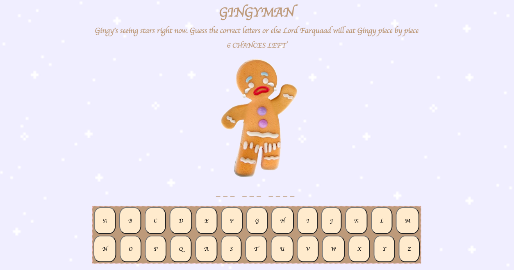
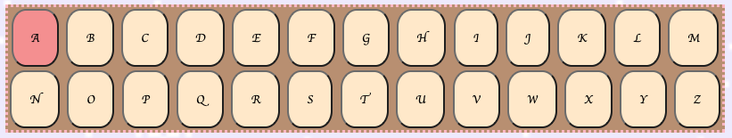
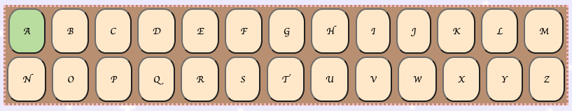
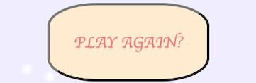
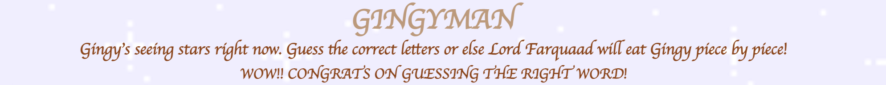
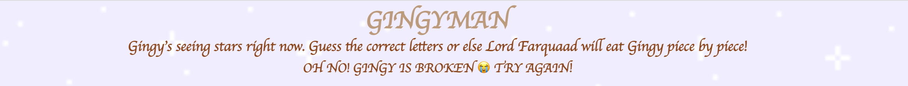

<h1>GINGYMAN</h1>
<h2>Welcome to Kristina's Gingyman!</h2>
The outcome of this game is to guess a letter and see if the letter is displayed in the underscore(s). There are six chances given, and each incorrect letter guessed will remove a piece of Gingy.
 
 
When the player selects a letter, the letter will not be able to be clicked again. All buttons are a shade of yellowish brown and if an incorrect letter is guessed, the button color will change to red. Otherwise, if a correct letter is guessed, the letter will replace the underscore(s), and the button color will change to green. Once a letter is clicked, the player will not be able to click the same letter.
 
 
If the player uses all six chances, a message will pop up indicating that the player lost, and the play again button will pop up. Or if the player is able to guess the word, a congratulatory message will pop up, and the play again button will pop up as well. Whether the player won or lost the game, the secret word will be revealed.

 
<h2>Screenshots</h2>
The start of the game:
 

 
When the player chooses the wrong letter and Gingy loses a piece of himself:
 

 
When the player chooses the right letter:
 

 
If the player wins or loses the game, the replay button pops up on the bottom:
 

 
When the player wins the game, a congratulatory message shows up on the top:
 

 
When the player loses, a lost message shows up on the top:
 

 
<h2>Technologies Used</h2>

* HTML
* CSS
* JavaScript
 
<h2>Getting Started</h2>
Click this link down below to play Gingyman:
[Play Gingyman]("https://kristina-lim.github.io/Gingyman/")

 
<h2>Next Steps (Icebox Items)</h2>

* Make the button(s) change color when clicked: green for correct and red for incorrect.
* Add a media query to reformat the game on an iPhone screen.
* Change mouse cursor to a gingerbread man.
